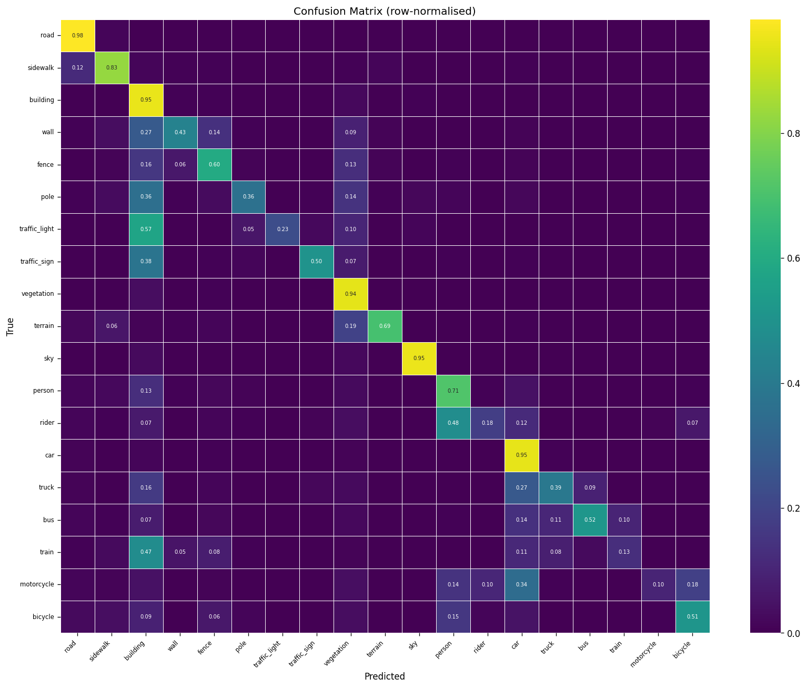
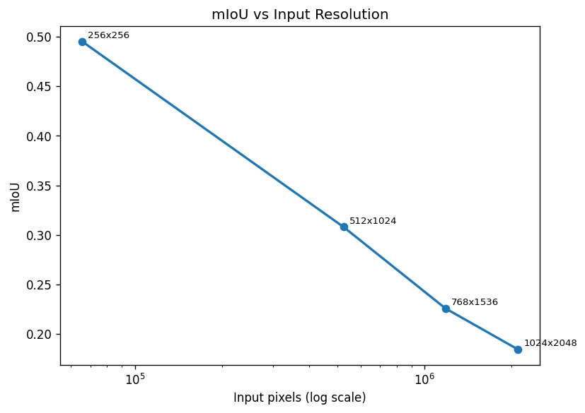
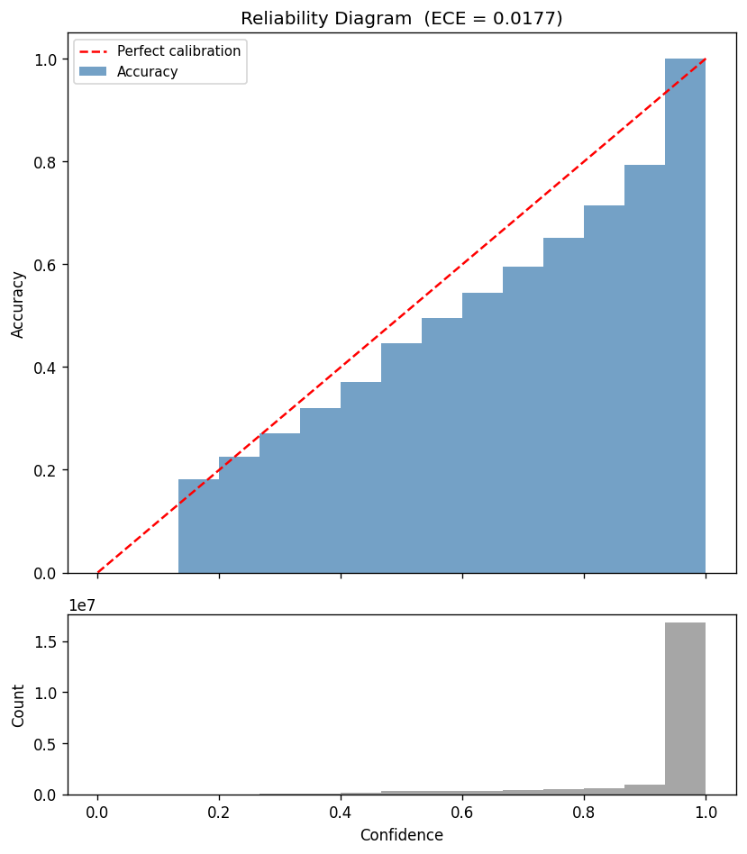

# Baseline Diagnostics Summary

## D1 -- Per-Class IoU

**mIoU = 0.4953**  |  **Pixel Acc = 0.9199**

See [per_class_iou.md](per_class_iou.md)

## D2 -- Confusion Matrix

See [top_confusions.md](top_confusions.md)

## D3 -- Boundary vs Interior

| width_px | acc_boundary | acc_interior | ratio | miou_boundary | miou_interior |
|---:|---:|---:|---:|---:|---:|
| 1 | 0.5984 | 0.9315 | 0.6424 | 0.2416 | 0.5158 |
| 3 | 0.6384 | 0.9426 | 0.6773 | 0.2810 | 0.5389 |
| 9 | 0.7392 | 0.9581 | 0.7715 | 0.3634 | 0.5723 |

## D5 -- Qualitative Examples

See [qualitative/](qualitative/) folder.

## D6 -- Resolution Sweep

| input_h | input_w | mIoU |
|---:|---:|---:|
| 256 | 256 | 0.4953 |
| 512 | 1024 | 0.3081 |
| 768 | 1536 | 0.2260 |
| 1024 | 2048 | 0.1847 |

## D7 -- Calibration  (ECE = 0.0177)

See [calibration.csv](calibration.csv)

## D11 -- Train / Val Gap

| split | n_images | mIoU | pixel_acc |
|:---|---:|---:|---:|
| train (eval) | 500 | 0.7149 | 0.9556 |
| val          | 503   | 0.4953 | 0.9199 |
